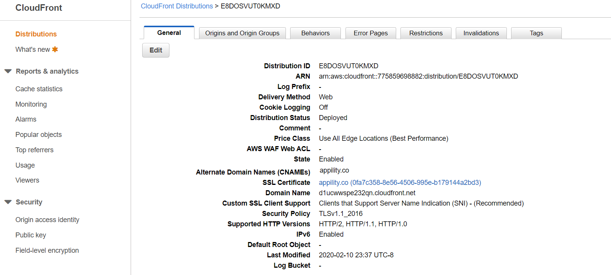
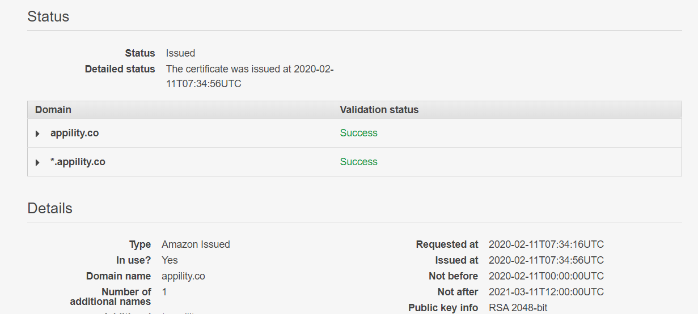

Appility is a completely serverless application leveraging AWS.

[Please visit the website at appility.co](https://appility.co)

Appility has various quizzes on various technologies ranging from React to AWS itself. It features user authentication, persistent score tracking & updating, responsiveness, and strong performance.

## Technologies

### Front End

-   React - Appility's front end is built upon React. With the introduction to React Hooks, I am able to exclusively use React Function Components to render all content. There is gratuitous use of common hooks such as useState and useEffect to enable interactions.

-   Redux - Although useState is useful for managing component level state; Redux is leveraged here to enable application-wide state. For example, users trigger an action creator to fetch quiz scores via an API; which then returns a response with data that will be stored within the application state; this data can then be accessed from any level of the React component tree.

-   Material UI - The style framework of choice is Material UI. It has a strong library of various pre-built components that are very customizable. Appility relies upon various UI components such as the Navbar, LinearProgress, Cards, Grids, etc. For customization, there is much use of Material UI's makeStyles and useMediaQuery.

-   React Spring - React Spring is a great physics-based animation library that enables very easy-to-use animations. You can see these animations in Appility in various sections.

### Back End

Appility leverages serverless architecture for its backend. The benefits of serverless architecture is cost (you only pay for what you use), scalability (services scale automatically according to traffic), and ease (no need to manage or maintain a server).

-   API Gateway - All API services are hosted on API Gateway, which acts as a "front door" for all API requests. API Gateway handles all tasks involved in accepting and processing up to hundreds of thousands of concurrent API calls, CORS support, authorization, etc. I use API Gateway to accept/validate API calls and forward them to Lambda for processing.

-   API Gateway is used to provide authentication in conjunction with AWS Cognito. Currently, all API calls to API Gatway require a user to include a JwtToken provided by AWS Cognito. Without a valid JwtToken, API Gateway blocks the call via the Method Request; if a valid JwtToken is provided, then that the user identifer is extracted from the token within the mapping parameters via "\$context.authorizer.claims.sub" within Integration Request.

-   Lambda - While API Gateway acts as the "front door" to my serverless backend, Lambda does all the heavy lifting when it comes to processing requests, interacting with the database, and returning the appropriate response. An example of my Lambda usage is handling get requests: When API Gateway receives a GET request, it forwards all the relevant information including the user ID to the appropriate Lambda function. The Lambda function then takes the user ID, fetches the data from DynamoDB, then returns the data back to API Gateway, which is returned to the user as a response.

-   DynamoDB - DynamoDB is a NoSQL database that is also serverless. It scales automatically and this lends itself to ease of use and cost savings. I use DynamoDB to store various quiz scores on various user records.

-   Cognito - Cognito manages authorization via User Pools and User Identities. Appility was formerly built upon a Node Express backend which utilized Passport for cookie-session authentication; while this worked - it required a lot of cost in time and effort to implement the different strategies and validations. With Cognito, the underlying authentication logic is already implemented in their system, thus saving plenty of time that could otherwise be used on other aspects of development. It also offers many features out-of-the-box such as code confirmation, password resets, attribute changes, etc.

### Deployment

I leverage AWS' CICD process to seamlessly deploy Appility.

-   CodePipeline - CodePipeline is the orchestrator of the entire CICD process. The process begins when it detects a push to my Appility Github repository.

-   CodeBuild - Once the Github webhook triggers the CICD process, CodeBuild takes the source content within the Appility Github repository and begins the build process. The build process is guided by the buildspec.yml file that contains various instructions for the various build stages. Once the build process is complete, it yields a build directory containing the content for the newly-built application.

-   S3 - Upon CodeBuild completion, CodeDeploy takes the resulting build directory and stores it in an S3 Bucket that is configured to host websites.

-   CloudFront - CloudFront is AWS' Content Delivery Network (CDN) service. I leverage CloudFront to distribute the contents of my website contained in the S3 bucket for best performance throughout the network.

-   Amazon Certificate Manager - SSL certification is provide freely by ACM; this ensures all information in-flight is sent securely using encryption.
